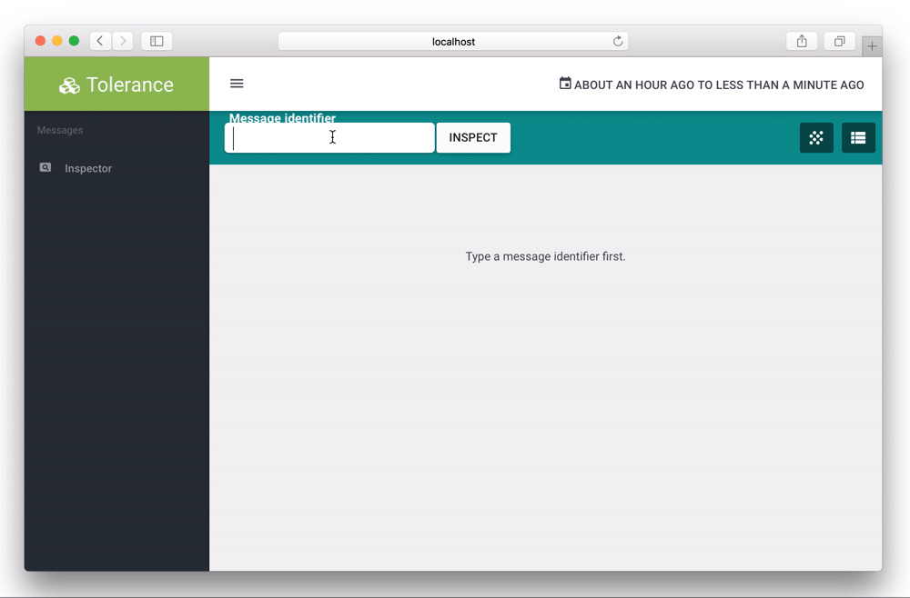

# Tolerance Viewer

This Viewer comes with the [Tolerance library](http://tolerance.io). This application helps to visualize the tracked
messages using the MessageIdentifier component.

This application is composed of these two components:
- [User interface](user-interface/), an AngularJS application that exposes... the user interface.
- [API](api/), an Symfony application exposing the data through a REST API.

## Getting started

You can simply use the built Docker images for the API and the UI, checkout their respective documentations.

- [API Docker image](api/README.md#docker)
- [User-Interface Docker image](user-interface/README.md#docker)

## Contributing

If you want to run the viewer in a developer mode:

1. Checkout this repository
2. Install the application (see their respective `README.md` file)
3. Run the 2 containers with Docker. If you've installed Docker using [dock-cli](https://inviqa.com/inviqa/dock-cli)
   you can simply run `dock-cli start` and you'll see the DNS addresses of the running containers. Else, simply use
   docker-compose.

## License

This project is under the [MIT license](LICENSE).

